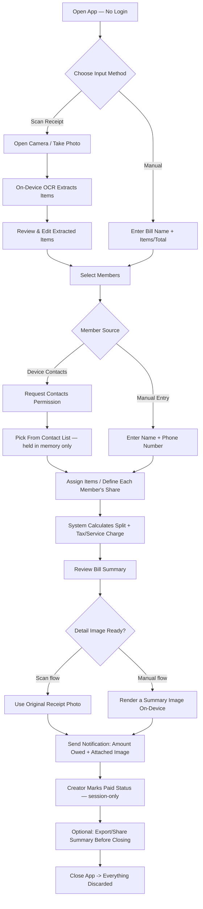

# PRD: SplitYuk — Split Bill App

**Product Requirements Document — v0.3 (Draft)**
Created: September 4, 2026
Author: Kartika Widya Arjentinia

> "SplitYuk" is just a placeholder name — rename as you see fit.

---

## 1. Overview

SplitYuk is a mobile app (Android & iOS) for splitting a bill among a group of people — friends/family picked from the device's contacts or added manually — using either a **receipt scan** (OCR) or **manual input**. Once the split is calculated, each member receives a notification (WhatsApp/Email) telling them exactly how much they owe, with the original receipt (or a generated summary image) attached for full detail. **How and where they actually pay is coordinated directly between the group, outside the app** — the app deliberately does not collect or transmit any payment-destination information.

## 2. Problem Statement

Splitting a bill after a group meal or shopping trip is usually done manually (calculator, scribbled notes), which is error-prone once tax/service charge is involved, and chasing people to pay is awkward because it means messaging each person one by one. SplitYuk automates the calculation (including reading the receipt automatically) and tells each person exactly what they owe.

## 3. Core Design Principle: No Personal Data Is Ever Stored

This is the defining constraint of the product and shapes almost every decision below.

- **Never stored, anywhere, at any point (server or on-device beyond the active session):** bill contents, receipt photos, item lists, contact data accessed from the device, member phone numbers/emails, payment status history.
- **Deliberately never collected at all (not even transiently):** payment destination information (bank account, e-wallet, QRIS). See §6 and §9.6 for why this was removed entirely rather than handled "securely" — the safest way to protect sensitive financial data is to never let it enter the system.
- **The one narrow exception:** the backend keeps two pieces of **fully anonymized, non-identifying** state — (a) a per-installation rate-limit counter to prevent API abuse, and (b) aggregate delivery-success counters for product metrics. Neither is tied to a bill, a phone number, a name, or any identifiable person — see §12.
- **What can persist without contradicting this principle:** native OS permission grants (camera, contacts) — that's OS-level app state, not personal data.
- **Necessary transient processing is not storage:** sending a WhatsApp/email notification requires the recipient's phone number/email, the amount, and an attached image to pass through a backend relay for a single request. This is unavoidable, but the relay must not log, cache, or write any of it — it forwards the request and discards it immediately.
- **Consequence:** if the app is closed or killed before the user finishes, the bill is gone — no draft recovery. See §11 and §17.

## 4. Goals & Success Metrics

| Goal | Metric | Indicative Target |
|---|---|---|
| Speed up the split-bill process | Time from opening the app to notifications sent | < 3 minutes |
| Accuracy of receipt-scan splitting | % of items parsed correctly without manual edits | > 80% |
| Reliable reminders | % of notifications delivered successfully, measured via the anonymized aggregate counters in §12 (not per-user logs) | > 95% |
| Trust/privacy positioning | The app's privacy notice can honestly state "we don't store your bills, contacts, or financial information" | N/A (qualitative) |

## 5. Target Users

- **Primary:** Young urban adults (18–30) who frequently split meals, hangouts, shared rent/kos, or trip expenses with friends.
- **Secondary:** The "designated payer" — the person everyone transfers money to, who currently has to chase everyone manually.

## 6. Scope

### In-Scope (MVP)
- Create a bill via receipt scan (OCR + review/edit) or manual input (itemized or total-only)
- Pick members from device contacts (with permission) or add manually (name + phone number)
- Assign items to members; split calculation (equal / custom % / custom amount / per-item)
- Send a notification via WhatsApp and/or Email stating each member's amount owed, with the receipt photo or a generated summary image attached
- Mark payment status manually (paid/unpaid) — valid for the current session only
- Share/export the final bill summary (image or text) so the user has an external record

### Explicitly Out-of-Scope (by design)
- **In-app payment processing** (Midtrans, etc.)
- **Collecting or transmitting any payment destination** (bank account, e-wallet number, QRIS) — removed entirely; sensitive financial data should never pass through an unofficial third-party channel like Fonnte, so the app simply doesn't handle it. Payment coordination (where to send money) happens outside the app, the same way the group already coordinates today.
- **User accounts / login**
- **Bill history, recurring/saved groups, saved contacts, or any "profile" settings**
- Multi-currency (assumption: IDR only for now)

## 7. Key Decisions Recap (cumulative)

| Question | Decision |
|---|---|
| Does the app process payments? | No — reminder-only. |
| Split mode from a scanned receipt? | Both itemized and quick equal/custom-% modes are available. |
| WhatsApp channel? | Fonnte (unofficial gateway) — known unresolved scaling/trust risk, see §15. |
| Data storage policy? | No personal data stored anywhere, ever — see §3. |
| **Payment destination field?** | **Removed entirely.** Sending bank/e-wallet numbers in plaintext through an unofficial WhatsApp gateway was a real security exposure; rather than try to "secure" that channel, the field itself was cut. Payment coordination happens outside the app. |
| **How does the recipient see bill detail?** | **No hosted link** (would require persistence). Instead, the original receipt photo (scan flow) or a generated summary image (manual-entry flow) is attached directly to the notification message. |

## 8. Main User Flow

## 9. Functional Requirements

### 9.1 App Access
- **FR-1.1** No account or login required.
- **FR-1.2** A short first-run explainer describes why the app needs camera/contacts permission, before the native OS permission dialog appears.

### 9.2 Create Bill — Receipt Scan
- **FR-2.1** User can take a photo directly or pick one from the gallery. Processed on-device, never uploaded anywhere except as a notification attachment at send-time (§9.7).
- **FR-2.2** On-device OCR extracts item names, quantity, unit price/subtotal, and total/tax/service charge lines if detected.
- **FR-2.3** Extracted results **must** be shown on a review screen before proceeding, fully editable.
- **FR-2.4** The system recalculates the total from the reviewed items and compares it against the receipt's printed total; show a non-blocking warning if they differ.
- **FR-2.5** The reviewed/corrected receipt photo is retained in memory (not re-uploaded, not persisted) so it can be attached to notifications later in the flow.

### 9.3 Create Bill — Manual Input
- **FR-3.1** User can enter items line-by-line (name + price) or just a total amount.
- **FR-3.2** Optional fields: tax (%), service charge (%), discount (amount/%).
- **FR-3.3** Since there is no original photo in this flow, the app must render a clean, shareable summary image of the final bill (items, prices, per-member totals) on-device once the split is finalized, to be attached to notifications (see FR-7.2).

### 9.4 Member Management
- **FR-4.1** Show a permission rationale screen before the native contacts permission dialog.
- **FR-4.2** If granted, show a searchable, multi-select device contact list, held in memory for this session only.
- **FR-4.3** If denied, or the person isn't in contacts, allow adding a member manually: name + phone number (required) + email (optional).
- **FR-4.4** All members are treated the same — just a name and a delivery channel for this one notification.

### 9.5 Item Assignment & Split Calculation
- **FR-5.1** Each item can be assigned to one member or split across several at once.
- **FR-5.2** Tax/service charge/fees distributed proportionally to each member's item subtotal, unless the user chooses "split all extra charges equally."
- **FR-5.3** Quick non-itemized modes: Equal Split, Percentage Split (must total 100%), Custom Amount (must total the full bill).
- **FR-5.4** The system validates that all members' shares sum to the bill total before allowing the user to proceed.
- **FR-5.5** Rounding remainder is charged to the bill creator by default (manually reassignable).

### 9.6 ~~Payment Destination~~ (Removed)
This section intentionally left out — see §6 and §7. The app does not ask for, store, or transmit any bank account, e-wallet, or QRIS information. If the group needs to coordinate a payment method, that conversation happens outside the app.

### 9.7 Notifications & Reminders
- **FR-7.1** After the bill is finalized, the system sends each member a notification via WhatsApp (through Fonnte) and/or Email, based on what contact info was provided.
- **FR-7.2** The message body is short and personalized: bill name + this member's amount owed. The original receipt photo (scan flow) or the rendered summary image (manual flow, per FR-3.3) is attached for anyone who wants the full breakdown. No external link is used.
- **FR-7.3** The creator can manually resend a reminder at any time during the current session for members still marked unpaid.
- **FR-7.4** Delivery success/failure is shown immediately in the UI for this session. It also increments the fully anonymized aggregate counters described in §12 — never a per-user or per-bill log.

### 9.8 Payment Status Tracking (Session-Only)
- **FR-8.1** Each member has a status: Unpaid / Paid, toggled manually by the creator, existing only in the current session.
- **FR-8.2** The bill screen shows live progress for as long as the session is active.
- **FR-8.3** Before leaving an unfinished/unsent bill, show a confirmation that it will be discarded, since there is no auto-save. (Note: this cannot protect against the OS killing the app in the background — see the open item in §17.)

## 10. Suggested Additional Features (for consideration, not decided)

| Feature | Rationale |
|---|---|
| **Share/export the bill summary as an image or text** | The only way a user keeps any record after closing the app — treat as near-essential rather than purely optional. |
| One-off "quick split" shortcut (skip naming the bill) | For casual, ad-hoc situations like a taxi fare. |
| Item split by portion weight (e.g., someone ordered a double portion) | Common real-world case where shares aren't identical. |

~~Attach a static QRIS image to the notification~~ — removed for consistency with §6/§7: a QRIS code encodes payment-destination data just like a bank account number does, so keeping it as a "nice to have" would quietly reintroduce the exact problem the payment-destination field was removed to avoid.

**Note:** *recurring groups* and *scheduled automatic reminders* are still not compatible with the zero-persistence principle — both require the app to remember something about a bill after the user has left it. See §17.

## 11. Critical Business Rules / Edge Cases

1. **Unassigned item** — block proceeding to notifications if any item isn't assigned to someone.
2. **OCR total mismatch** — non-blocking warning if reviewed items' total ≠ receipt's printed total.
3. **Member removed mid-assignment** — their assigned items revert to "unassigned," never silently disappear.
4. **Invalid/unreachable phone number** — fall back to email; if neither works, mark "not reachable automatically" and suggest sharing the summary manually.
5. **Rounding** — remainder charged to one party (default: creator) so totals reconcile.
6. **Bill edited after notifications were sent** — must trigger an updated notification, not a silent change.
7. **App closed/killed mid-flow** — all progress lost, no draft recovery; must be communicated in the UI (FR-8.3).
8. **Manual-entry bill with no photo** — the rendered summary image (FR-3.3) must be generated and previewable *before* sending, so the creator can confirm it looks correct.

## 12. Non-Functional Requirements

| Category | Requirement |
|---|---|
| Privacy — core | No bill data, contact data, receipt images, or payment information is written to any database, file, or cache — server-side or on-device — beyond the active session's in-memory state. |
| Privacy — relay | The backend relay must be stateless with respect to content: no logging of phone numbers, amounts, message text, or attached images. Standard platform access logs must be scrubbed of these fields. |
| Privacy — third parties | Fonnte and the email provider are outside our control and may retain their own delivery logs per their own policies — disclose this transparently in the app's privacy notice. |
| Privacy — OCR | Receipt OCR runs fully on-device; the photo is never uploaded except as a one-time notification attachment. |
| **Abuse prevention** | The relay must rate-limit requests using a random, non-identifying per-installation token generated on first app launch (not tied to a phone number, contact, or any personal identifier) — otherwise the endpoint is an open door for anyone who extracts it from the APK to send spam through the app's Fonnte/email quota. |
| **Metrics without PII** | Delivery outcomes increment simple aggregate counters (e.g., "notifications_sent_total", "notifications_failed_total") with no link to a specific bill, phone number, or person — this is the only way §4's delivery-rate metric can be measured honestly under the no-PII-storage principle. |
| Reliability | If WhatsApp delivery (Fonnte) fails, the relay retries once, then falls back to email if available. |
| Performance | Photo-to-review-ready OCR result in < 5 seconds on a mid-range device. |

## 13. Tech Stack & Architecture

| Layer | Technology | Why |
|---|---|---|
| Mobile App | **Flutter** (Android & iOS) | Cross-platform, in-demand, matches your existing experience. |
| Backend | **Stateless serverless function** (Vercel Functions, Node.js/TypeScript) | Holds the Fonnte/Email API keys server-side and relays one request at a time; no relational data to model, so no reason to run a full database. |
| Rate-limit / anonymized counters | **A lightweight KV store, e.g. Upstash Redis** (integrates natively with Vercel) | Deliberately not Postgres — there's no relational user/bill data to justify a schema; a simple counter store is the right-sized tool and keeps the "no personal data modeled anywhere" story honest. |
| OCR | **Google ML Kit — Text Recognition** (on-device) + custom parser | Free, fast, offline; the photo never leaves the device except as a notification attachment. |
| WhatsApp Notification | **Fonnte**, called only from the relay | See risk notes in §15 — including one not yet addressed, flagged there explicitly. |
| Email Notification | Resend/SendGrid via the same relay | Fallback channel. |
| Device Contacts | `flutter_contacts` | In-memory only for the session. |
| Camera/Gallery | `image_picker` / `camera` | Captures the receipt photo. |
| Image rendering (manual-entry summary) | Flutter `RepaintBoundary` (or equivalent) to render a widget to an image on-device | Produces the attachment described in FR-3.3 without needing any server-side rendering. |

## 14. Runtime (In-Memory) Session State — No Persistent Database for Bill Data

| Object | Key Fields (in-memory only) |
|---|---|
| `Bill` | title, receiptImage or renderedSummaryImage, subtotal, tax, serviceCharge, discount, total |
| `BillItem` | name, qty, price, assignedMemberIds[] |
| `Member` | name, phone, email, amountDue, isPaid (session-only flag) |

The only thing that exists server-side across sessions is the fully anonymized rate-limit/metrics state described in §12 — nothing here.

## 15. Third-Party Integrations & Risks

| Service | Function | Notes / Risk |
|---|---|---|
| **Fonnte** | Send WhatsApp payment notifications | Unofficial WhatsApp API (not a Meta-verified BSP) — automates a WhatsApp Web/multi-device session via QR scan, violating WhatsApp's ToS for automated messaging. Risk of the sending number being rate-limited/banned, outside our control. **Known unresolved risk, not addressed in this revision:** if every app user's notifications are sent from one single Fonnte-connected number, that number will send high volumes of unrelated messages to strangers in a short time — a pattern WhatsApp's anti-spam systems are specifically built to catch, making a ban likely quickly at any real scale. It also looks suspicious to recipients (a bill reminder from an unknown number rather than their friend's own number). This needs a dedicated design pass — e.g., per-installation Fonnte device linking, or moving to the official WhatsApp Cloud API. |
| Google ML Kit | Receipt OCR | On-device, free; accuracy varies — always route through manual review (§9.2). |
| Resend/SendGrid | Email fallback | Needs a verified sending domain to avoid spam filters. |

## 16. Roadmap & Phasing

| Phase | Focus |
|---|---|
| **MVP (Phase 1)** | Scan/manual input → assignment → split → notification with attached detail image → manual paid/unpaid marking (session-only) → export/share. Anonymized rate-limiting and metrics from day one. |
| **Phase 2** | Item-by-portion splitting, quick one-off split mode. A dedicated design pass on the Fonnte single-number risk (§15) belongs here too. |
| **Phase 3 (requires revisiting §3 first)** | Anything needing the app to remember state after the user leaves — e.g., scheduled auto-reminders, recurring groups. |

## 17. Open Questions / Tensions to Resolve

- **No payment destination at all — is that too bare?** Consider a softer middle ground later: a free-text "payment note" field (e.g., "transfer to my usual OVO") that's deliberately unstructured/ambiguous, rather than a precise account number — lower risk than what was removed, but still gives the recipient a hint. Not implemented now; worth a product decision.
- **Auto-reminder vs. zero persistence** — still fundamentally incompatible; decide whether a narrow, auto-deleting exception is ever acceptable.
- **"No accounts" implication** — no way to verify who created a bill; acceptable for trusted friend groups, but worth naming as an accepted limitation.
- **Carried over from prior review, not yet addressed in this revision:**
  - The single shared Fonnte number problem (§15) — the most serious open risk in this document.
  - `image_picker`/`camera` typically write a temporary file to device disk before it's usable, which is a small but real exception to "never touches local storage" — needs an explicit requirement to delete the temp file immediately after OCR/attachment use.
  - The FR-8.3 exit warning only covers the user *choosing* to leave; it cannot protect against the OS killing the app in the background, which is arguably the more common real-world cause of lost progress.

---
*This is a draft — ready to be broken down into user stories/backlog items, or used as the basis for low-fi wireframes if needed.*
